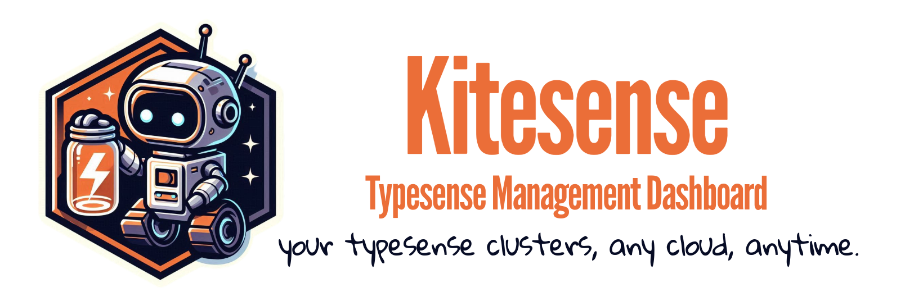

# Kitesense

<div align="center">



<br/>

[](https://golang.org)
[](https://reactjs.org)
[](https://www.typescriptlang.org)
[](LICENSE)

</div>

**Kitesense** is a dedicated control center for running and manage Typesense on any Kubernetes cluster. It lets you launch and operate Typesense deployments anywhere, track their health, and coordinate multiple environments from a single place. Designed for clarity and speed, Kitesense streamlines the entire lifecycle of your search infrastructure. Your Typesense clusters, any cloud, anytime.

> [!IMPORTANT]
> Kitesense is a repurposed derivative of the original [Kite](https://github.com/zxh326/kite) project. All credit for the foundation and core design goes to the Kite maintainers.


_Analytical cluster and quorum overview with real-time monitoring of raft nodes_

---

## ✨ Features

### 🎯 **Modern User Experience**

- 🌓 **Multi-Theme Support** - Dark/light/color themes with system preference detection
- 🔍 **Advanced Search** - Global search across all resources
- 🌐 **Internationalization** - Support for English and Chinese languages
- 📱 **Responsive Design** - Optimized for desktop, tablet, and mobile devices

### 🏘️ **Multi-Cluster Management**

- 🔄 **Seamless Cluster Switching** - Switch between multiple Kubernetes clusters
- 📊 **Per-Cluster Monitoring** - Independent Prometheus configuration for each cluster
- ⚙️ **Kubeconfig Integration** - Automatic discovery of clusters from your kubeconfig file
- 🔐 **Cluster Access Control** - Fine-grained permissions for cluster access management

### 🔍 **Comprehensive Resource Management**

- 📋 **Full Resource Coverage** - Pods, Deployments, Services, ConfigMaps, Secrets, PVs, PVCs, Nodes, and more
- 📄 **Live YAML Editing** - Built-in Monaco editor with syntax highlighting and validation
- 📊 **Detailed Resource Views** - In-depth information with containers, volumes, events, and conditions
- 🔗 **Resource Relationships** - Visualize connections between related resources (e.g., Deployment → Pods)
- ⚙️ **Resource Operations** - Create, update, delete, scale, and restart resources directly from the UI
- 🔄 **Custom Resources** - Full support for CRDs (Custom Resource Definitions)
- 🏷️ **Quick Image Tag Selector** - Easily select and change container image tags based on Docker and container registry APIs
- 🎨 **Customizable Sidebar** - Customize sidebar visibility and order, and add CRDs for quick access
- 🔌 **Kube Proxy** - Access pods or services directly through Kite, no more `kubectl port-forward`

### 📈 **Monitoring & Observability**

- 📊 **Real-time Metrics** - CPU, memory, and network usage charts powered by Prometheus
- 📋 **Cluster Overview** - Comprehensive cluster health and resource statistics
- 📝 **Live Logs** - Stream pod logs in real-time with filtering and search capabilities
- 💻 **Web/Node Terminal** - Execute commands directly in pods/nodes through the browser
- 📈 **Node Monitoring** - Detailed node-level performance metrics and utilization
- 📊 **Pod Monitoring** - Individual pod resource usage and performance tracking

### 🔐 **Security**

- 🛡️ **OAuth Integration** - Supports OAuth management in the UI
- 🔒 **Role-Based Access Control** - Supports user permission management in the UI
- 👥 **User Management** - Comprehensive user management and role allocation in the UI


## ⚡ Get Started

Kitesense can be installed as a solo Docker container, as optional component of [TyKO](https://github.com/akyriako/typesense-operator) (Typesense Kubernetes Operator) or as independent deployment in a separate management cluster designated to manage all your Typesense clusters on local or remote Kubernetes environments.

### Docker

To run Kitesense using Docker:

```bash
docker run --rm -p 8080:8080 akyriako78/kitesense:latest
```

### Docker Compose

```bash
docker run --rm -p 8080:8080 akyriako78/kitesense:latest
```

### Kubernetes

```bash
helm repo add kitesense https://akyriako.github.io/Kitesense
helm repo update

helm upgrade --install kitesense kitesense/kitesense -n typesense-system --create-namespace
```

### Local Development

#### Clone the repository

```bash
git clone https://github.com/akyriako/kitesense.git
cd kitesense
   ```

#### Build the project

```bash
make deps
make build
```

#### Run the static build

```bash
make run
```

#### Run with hot reload

```bash
make dev
```

> [!IMPORTANT]  
> Any change on the backend Go project will require restarting with `make dev`. The hot-reloading feature applies only for frontend TypeScript changes.

### Remote Container Development

Any IDE that supports [Dev Containers](https://code.visualstudio.com/docs/devcontainers/containers), but in this case everything is tailored for Visual Studio Code, will build a container with all the necessary prerequisites to get you started creating content immediately based on the extensions
and features defined in **devcontainer.json**. A `typescript-node:1-20-bookworm` container will be spawned with the following extras pre-installed:

* **Visual Studio Code Extensions**

  - JavaScript and TypeScript Nightly
  - React Native Tools
  - ES7+ React/Redux/React-Native snippets, Simple React Snippets
  - Simple React Snippets
  - Npm Intellisense, Npm Dependency, Path Intellisense
  - Git Graph
  - Resource Monitor
  - YAML
  - Thunder Client
  - Go
  - NeoXP Golang Tools

* **Features**

  - Git
  - Docker-in-Docker
  - Go
  - GolangCI Lint
  - GoReleaser

* **Post-Create Command**

  - `make deps && make build`

#### Add your own Extensions

You can add your own extensions in your Dev Container and customize it to the fullest. By right-clicking the desired extension in the *Marketplace* and choosing the *Add to devcontainer.json* the extension will be installed and activated the next time you rebuild your Dev Container.

> [!NOTE]  
> You can afterwards rebuild your container so the changes take effect, with our without using cache, in the latter  case it will rebuild the container from scratch.

#### Git Credentials

The Git extension will automatically forward your local **SSH agent**, if one is running otherwise it will use directly the git configuration of your local host. In that way you can take advantage of keeping tight control of your credentials and your SSH keys in one place, your local machine, and not spreading them individually to every new development enviroment.

## 📚 Documentation

- [Getting Started](https://akyriako.github.io/typesense-operator-docs/docs/getting-started)
- [How it works](https://akyriako.github.io/typesense-operator-docs/docs/how-it-works)
- [Configuration & CRD Specs](https://akyriako.github.io/typesense-operator-docs/docs/crds)
- [Monitoring & Metrics](https://akyriako.github.io/typesense-operator-docs/docs/metrics)

## 🔍 Troubleshooting

For troubleshooting, please refer to the [documentation](https://kite.zzde.me).

## 📦 Project Status

TyKO is an **independently maintained** project (not affiliated with Typesense, Inc.).
- Latest version: **0.3.5**
- Tested on: Kubernetes 1.33 (earliest 1.26), Typesense 29.0 (earliest 26.0)
- Contributions welcome! See [FAQ](https://akyriako.github.io/typesense-operator-docs/docs/faq) and [Development](https://akyriako.github.io/typesense-operator-docs/docs/development)


## 📄 License

This project is licensed under the Apache License 2.0 - see the [LICENSE](LICENSE) file for details.
