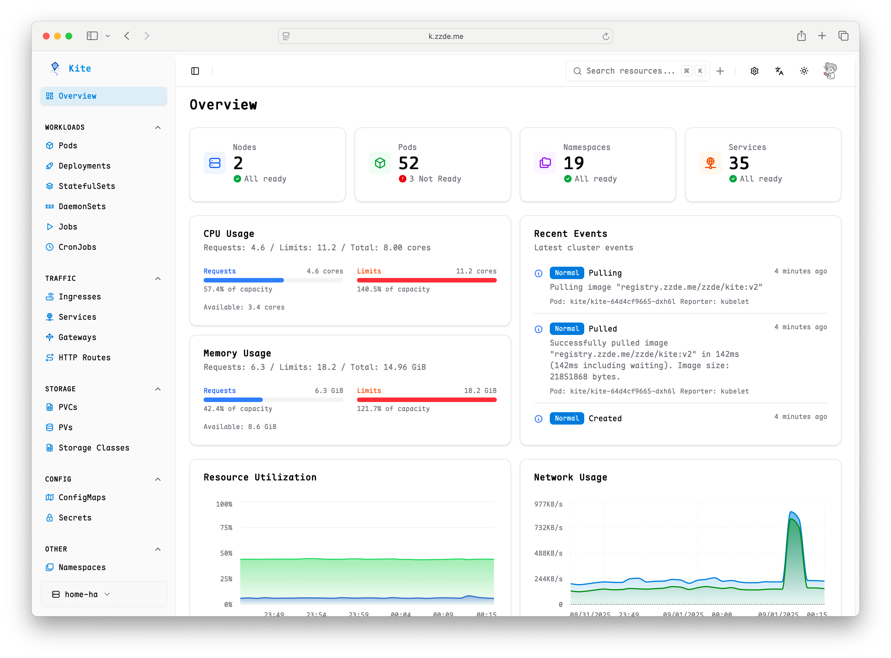

# Kite - Modern Kubernetes Dashboard

<div align="center">


_A modern, intuitive Kubernetes dashboard_

[](https://golang.org)
[](https://reactjs.org)
[](https://www.typescriptlang.org)
[](LICENSE)
[](https://hellogithub.com/repository/zxh326/kite)

[**Live Demo**](https://kite-demo.zzde.me) | [**Documentation**](https://kite.zzde.me)
<br>
**English** | [中文](./README_zh.md)

</div>

Kite is a lightweight, modern Kubernetes dashboard that provides an intuitive interface for managing and monitoring your Kubernetes clusters. It offers real-time metrics, comprehensive resource management, multi-cluster support, and a beautiful user experience.

> [!WARNING]
> This project is currently in rapid development and testing, and the usage and API may change.


_Comprehensive cluster overview with real-time metrics and resource statistics_

## ✨ Features

### 🎯 **Modern User Experience**

- 🌓 **Multi-Theme Support** - Dark/light/color themes with system preference detection
- 🔍 **Advanced Search** - Global search across all resources
- 🌐 **Internationalization** - Support for English and Chinese languages
- 📱 **Responsive Design** - Optimized for desktop, tablet, and mobile devices

### 🏘️ **Multi-Cluster Management**

- 🔄 **Seamless Cluster Switching** - Switch between multiple Kubernetes clusters
- 📊 **Per-Cluster Monitoring** - Independent Prometheus configuration for each cluster
- ⚙️ **Kubeconfig Integration** - Automatic discovery of clusters from your kubeconfig file
- 🔐 **Cluster Access Control** - Fine-grained permissions for cluster access management

### 🔍 **Comprehensive Resource Management**

- 📋 **Full Resource Coverage** - Pods, Deployments, Services, ConfigMaps, Secrets, PVs, PVCs, Nodes, and more
- 📄 **Live YAML Editing** - Built-in Monaco editor with syntax highlighting and validation
- 📊 **Detailed Resource Views** - In-depth information with containers, volumes, events, and conditions
- 🔗 **Resource Relationships** - Visualize connections between related resources (e.g., Deployment → Pods)
- ⚙️ **Resource Operations** - Create, update, delete, scale, and restart resources directly from the UI
- 🔄 **Custom Resources** - Full support for CRDs (Custom Resource Definitions)
- 🏷️ **Quick Image Tag Selector** - Easily select and change container image tags based on Docker and container registry APIs
- 🎨 **Customizable Sidebar** - Customize sidebar visibility and order, and add CRDs for quick access
- 🔌 **Kube Proxy** - Access pods or services directly through Kite, no more `kubectl port-forward`

### 📈 **Monitoring & Observability**

- 📊 **Real-time Metrics** - CPU, memory, and network usage charts powered by Prometheus
- 📋 **Cluster Overview** - Comprehensive cluster health and resource statistics
- 📝 **Live Logs** - Stream pod logs in real-time with filtering and search capabilities
- 💻 **Web/Node Terminal** - Execute commands directly in pods/nodes through the browser
- 📈 **Node Monitoring** - Detailed node-level performance metrics and utilization
- 📊 **Pod Monitoring** - Individual pod resource usage and performance tracking

### 🔐 **Security**

- 🛡️ **OAuth Integration** - Supports OAuth management in the UI
- 🔒 **Role-Based Access Control** - Supports user permission management in the UI
- 👥 **User Management** - Comprehensive user management and role allocation in the UI

---

## 🚀 Quick Start

For detailed instructions, please refer to the [documentation](https://kite.zzde.me/guide/installation.html).

### Docker

To run Kite using Docker, you can use the pre-built image:

```bash
docker run --rm -p 8080:8080 ghcr.io/zxh326/kite:latest
```

### Deploy in Kubernetes

#### Using Helm (Recommended)

1. **Add Helm repository**

   ```bash
   helm repo add kite https://zxh326.github.io/kite
   helm repo update
   ```

2. **Install with default values**

   ```bash
   helm install kite kite/kite -n kube-system
   ```

#### Using kubectl

1. **Apply deployment manifests**

   ```bash
   kubectl apply -f deploy/install.yaml
   # or install it online
   kubectl apply -f https://raw.githubusercontent.com/zxh326/kite/refs/heads/main/deploy/install.yaml
   ```

2. **Access via port-forward**

   ```bash
   kubectl port-forward -n kube-system svc/kite 8080:8080
   ```

### Build from Source

#### 📋 Prerequisites

1. **Clone the repository**

   ```bash
   git clone https://github.com/zxh326/kite.git
   cd kite
   ```

2. **Build the project**

   ```bash
   make deps
   make build
   ```

3. **Run the server**

   ```bash
   make run
   ```

---

## 🔍 Troubleshooting

For troubleshooting, please refer to the [documentation](https://kite.zzde.me).

## 💖 Support This Project

If you find Kite helpful, please consider supporting its development! Your donations help maintain and improve this project.

### Donation Methods

<table>
  <tr>
    <td align="center">
      <b>Alipay</b><br>
      
    </td>
    <td align="center">
      <b>WeChat Pay</b><br>
      
    </td>
    <td align="center">
      <b>PayPal</b><br>
      <a href="https://www.paypal.me/zxh326">
        
      </a>
    </td>
  </tr>
</table>

Thank you for your support! ❤️

## 🤝 Contributing

We welcome contributions! Please see our [contributing guidelines](https://kite.zzde.me/faq.html#how-can-i-contribute-to-kite) for details on how to get involved.

## 📄 License

This project is licensed under the Apache License 2.0 - see the [LICENSE](LICENSE) file for details.
