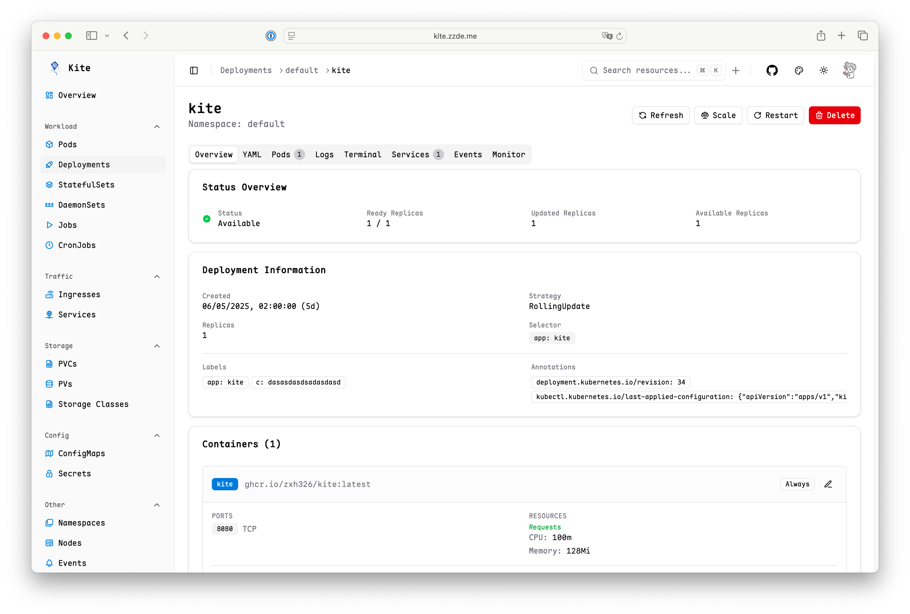
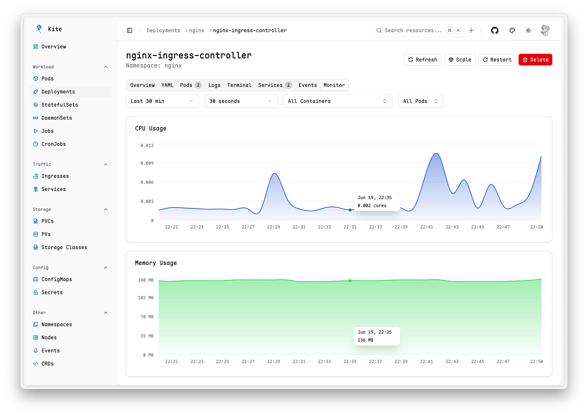
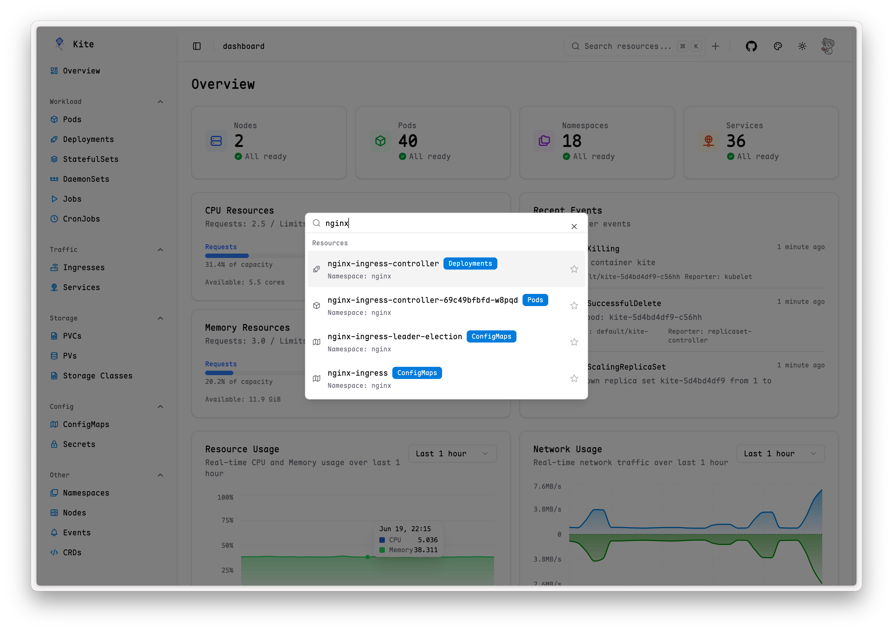
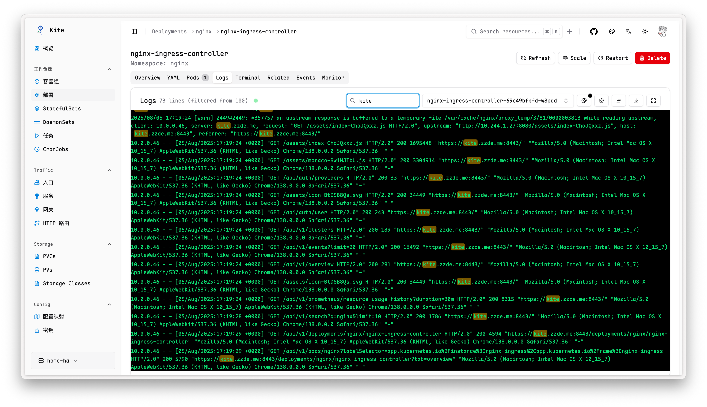
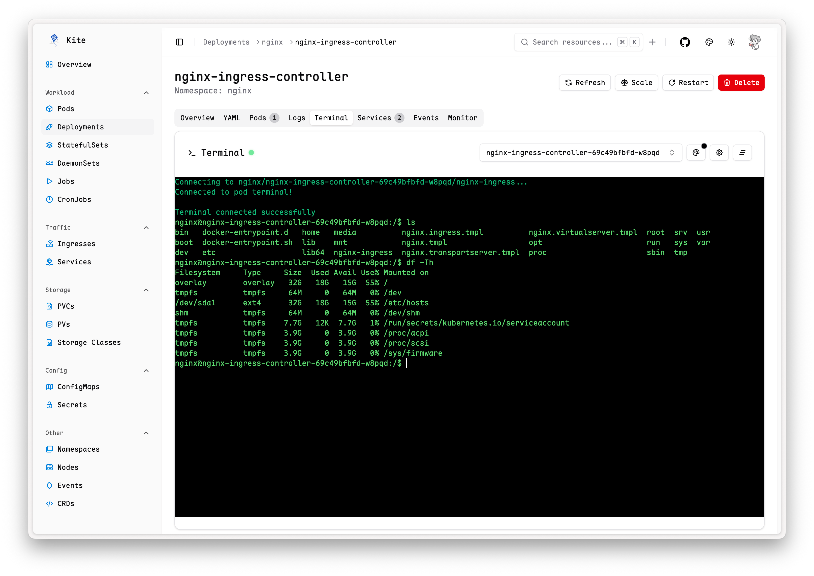
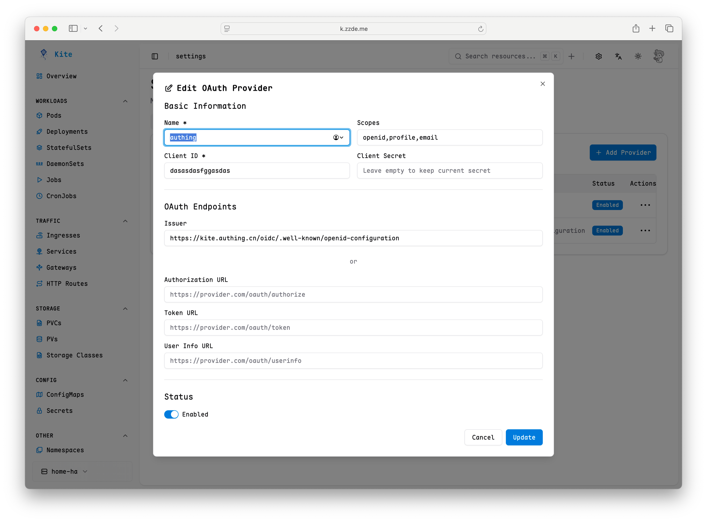

# Kite - Modern Kubernetes Dashboard

<div align="center">


_A modern, intuitive Kubernetes dashboard_

[](https://golang.org)
[](https://reactjs.org)
[](https://www.typescriptlang.org)
[](LICENSE)

</div>

Kite is a lightweight, modern Kubernetes dashboard that provides an intuitive interface for managing and monitoring your Kubernetes clusters. It offers real-time metrics, comprehensive resource management, multi-cluster support, and a beautiful user experience.

---

## 📸 Screenshots

### 🏠 Dashboard Overview


_Comprehensive cluster overview with real-time metrics and resource statistics_

<details>

<summary>More screenshots</summary>

### 🚀 Resource Management


_Detailed deployment view with pod management and status monitoring_

### 📊 Real-time Monitoring


_Real-time CPU, memory, and network usage charts with historical data_

### 🔍 Global Search


_Powerful search functionality across all Kubernetes resources_

### 📋 Live Logs


_Real-time log streaming with filtering and search capabilities_

### 💻 Web Terminal


_Execute commands directly in pods through the browser interface_

### 🔐 OAuth Authentication


_Secure authentication with GitHub and custom OAuth providers_

</details>

---

## ✨ Features

### 🎯 **Modern User Experience**

- 🌓 **Multi-Theme Support** - Dark/light/color themes with system preference detection
- 🔍 **Advanced Search** - Global search with across all resources

### 🏘️ **Multi-Cluster Management**

- 🔄 **Seamless Cluster Switching** - Switch between multiple Kubernetes clusters with a single click
- 📊 **Per-Cluster Monitoring** - Independent Prometheus configuration for each cluster
- ⚙️ **Kubeconfig Integration** - Automatic discovery of clusters from your kubeconfig file

### 🔍 **Comprehensive Resource Management**

- 📋 **Full Resource Coverage** - Pods, Deployments, Services, ConfigMaps, Secrets, PVs, PVCs, and more
- 📄 **Live YAML Editing** - Built-in Monaco editor with syntax highlighting and validation
- 📊 **Detailed Resource Views** - In-depth information with containers, volumes, events, and conditions
- 🔗 **Resource Relationships** - Visualize connections between related resources (e.g., Deployment → Pods)
- ⚙️ **Resource Operations** - Create, update, delete, scale, and restart resources directly from the UI
- 🔄 **Custom Resources** - Full support for CRDs (Custom Resource Definitions)
- 🏷️ **Quick Image Tag Selector** - Easily select and change container image tags based on Docker and container registry APIs

### 📈 **Monitoring & Observability**

- 📊 **Real-time Metrics** - CPU, memory, and network usage charts powered by Prometheus
- 📋 **Cluster Overview** - Comprehensive cluster health and resource statistics
- 📝 **Live Logs** - Stream pod logs in real-time with filtering and search capabilities
- 💻 **Web Terminal** - Execute commands directly in pods through the browser

### 🔐 **Authentication**

- 🛡️ **OAuth Integration** - Support for GitHub and custom OAuth providers
- 🔑 **Username/Password** - Simple authentication using environment variables

---

## 🚀 Quick Start

### Environment Variables

| Variable                   | Description                                                                                       | Default                       | Required |
| -------------------------- | ------------------------------------------------------------------------------------------------- | ----------------------------- | -------- |
| `PORT`                     | Server port                                                                                       | `8080`                        | No       |
| `KUBECONFIG`               | Kubernetes config path for multi-cluster access                                                   | `inCluster or ~/.kube/config` | No       |
| `ENABLE_ANALYTICS`         | Enable anonymous usage analytics                                                                  | `false`                       | No       |
| `PROMETHEUS_URL`           | Default Prometheus server URL [Prometheus Setup Guide](docs/PROMETHEUS_SETUP.md)                  | `-`                           | No       |
| `<CLUSTER>_PROMETHEUS_URL` | Cluster-specific Prometheus URL (see Multi-Cluster section below)                                 | `-`                           | No       |
| `JWT_SECRET`               | JWT secret for signing tokens. default is random string                                           | `random string`               | Yes\*    |
| `OAUTH_ENABLED`            | Enable OAuth authentication. [OAuth Setup Guide](docs/OAUTH_SETUP.md).                            | `false`                       | No       |
| `OAUTH_ALLOW_USERS`        | Comma-separated list of users allowed to access the dashboard,support wildcard (\*) for all users | `-`                           | OAuth\*  |
| `KITE_USERNAME`            | Username for basic authentication. If set, enables password auth.                                 | `-`                           | No       |
| `KITE_PASSWORD`            | Password for basic authentication. If set, enables password auth.                                 | `-`                           | No       |

\*Required only when OAuth is enabled

### Docker

To run Kite using Docker, you can use the pre-built image:

```bash
docker run --rm -p 8080:8080 -v ~/.kube/config:/home/nonroot/.kube/config ghcr.io/zxh326/kite:latest
```

### Deploy in Kubernetes

#### Using Helm (Recommended)

1. **Add Helm repository**

   ```bash
   helm repo add kite https://zxh326.github.io/kite
   helm repo update
   ```

2. **Install with default values**

   ```bash
   helm install kite kite/kite -n kube-system
   ```

#### Using kubectl

1. **Apply deployment manifests**

   ```bash
   kubectl apply -f deploy/install.yaml
   # or install it online
   kubectl apply -f https://raw.githubusercontent.com/zxh326/kite/refs/heads/main/deploy/install.yaml
   ```

2. **Access via port-forward**

   ```bash
   kubectl port-forward -n kube-system svc/kite 8080:80
   ```

### Build from Source

#### 📋 Prerequisites

1. **Clone the repository**

   ```bash
   git clone https://github.com/zxh326/kite.git
   cd kite
   ```

2. **Build the project**

   ```bash
   make deps
   make build
   ```

3. **Run the server**

   ```bash
   make run
   ```

---

## 🔍 Troubleshooting

### Common Issues

**1. Prometheus metrics not available**

see [Prometheus Setup Guide](docs/PROMETHEUS_SETUP.md) for configuring Prometheus and kube-state-metrics.

**2. OAuth authentication issues**

see [OAuth Setup Guide](docs/OAUTH_SETUP.md) for troubleshooting OAuth configuration.

**3. Analytics issues**

By default, kite will not collect any analytics data.

If you wish to help improve the product, you can set the environment variable `ENABLE_ANALYTICS=true`.

kite will use `umami` to collect very little anonymous usage.

source code is available at [Analytics](https://github.com/zxh326/kite/blob/main/pkg/utils/utils.go#L10-L16)

**4. Custom font**

build kite with `make build` and change the font in `./ui/src/index.css`

```css
@font-face {
  font-family: "Maple Mono";
  font-style: normal;
  font-display: swap;
  font-weight: 400;
  src: url(https://cdn.jsdelivr.net/fontsource/fonts/maple-mono@latest/latin-400-normal.woff2)
      format("woff2"), url(https://cdn.jsdelivr.net/fontsource/fonts/maple-mono@latest/latin-400-normal.woff)
      format("woff");
}

body {
  font-family: "Maple Mono", var(--font-sans);
}
```
