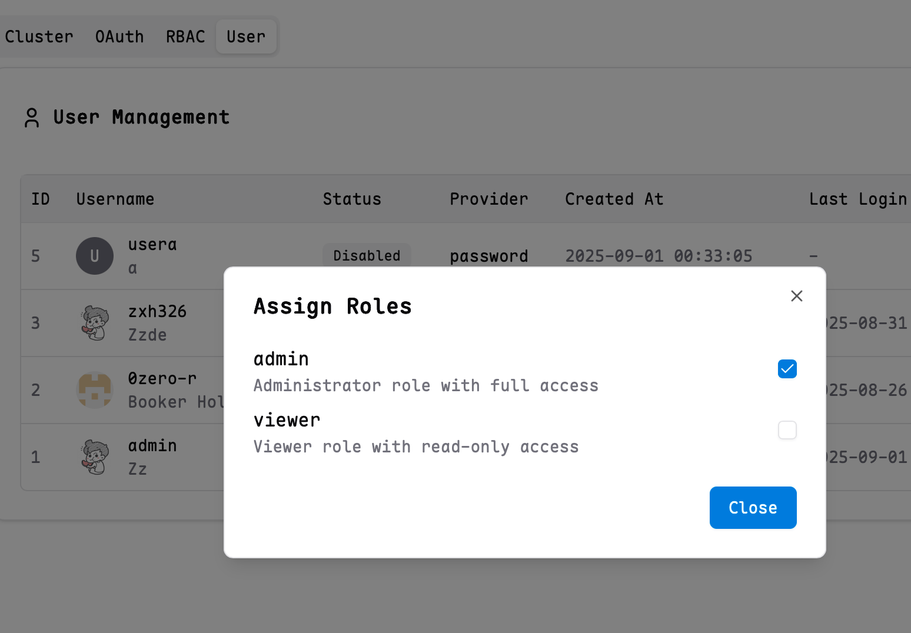

# RBAC Configuration Guide

This guide explains how to configure Role-Based Access Control (RBAC) in Kite to efficiently manage user permissions and resource access.

## Overview

Kite's RBAC system supports:

- Defining custom roles with specific permissions
- Assigning roles to users or OAuth groups
- Flexible access control at cluster, namespace, and resource levels
- Specifying allowed operations (verbs) for each role

## Configuration

Users with the **admin** role can access the settings entry in the upper right corner of the page.

The system provides two default roles that cannot be edited or deleted:

- **admin**: Has full permissions to manage all resources
- **viewer**: Has permissions to view all resources and logs


Each role can specify the following fields:

| Field         | Description                    | Example                                                    |
| ------------- | ------------------------------ | ---------------------------------------------------------- |
| `name`        | Role identifier                | `admin`, `viewer`                                          |
| `description` | Brief description (optional)   | `Administrator role with full access`                      |
| `clusters`    | Applicable clusters            | `!prod`, `dev` means can access dev but not prod           |
| `resources`   | Accessible resources           | `pods`, `deployments` for specific resources               |
| `namespaces`  | Applicable namespaces          | `!kube-system`, `*` means can access all namespaces except `kube-system` |
| `verbs`       | Allowed operations             | `get` for read-only operations                             |

### Supported Operation Verbs

- Common resources: `get`, `create`, `update`, `delete`
- Pod-specific: `exec`, `log` (for pod terminal and log access)
- Node-specific: `exec` (for node terminal access)
- Wildcard: `*` (all operations)

### Mapping Roles to OAuth Groups

You can assign roles to specific OAuth groups, so that all users in the group automatically inherit the corresponding permissions.

Note: Some OAuth groups may not be able to return user group and permission information. It is recommended to use the [DEX](https://github.com/dexidp/dex) project as a relay. Please ensure that the OAuth scope includes `groups` or `roles`.

You can configure or cancel group mapping in Role Actions.


### Mapping Roles to Users

You can assign roles to specified users to give them corresponding permissions.



## Example Scenarios

### Scenario 1: Testing Environment

Can access resources in all test, beta namespaces, but prohibits updates and deletions.

Configuration example:

```
clusters: *
resources: *
namespaces: test, beta
verbs: !delete, !update, *
```

### Scenario 2: Cluster Administrator

Assign full operation permissions to the `test-cluster` cluster administrator.

Configuration example:

```
clusters: test-cluster
resources: *
namespaces: *
verbs: *
```

### Scenario 3: Setting Default Roles for All OAuth Users

When your OAuth provider is trustworthy, such as a company's internal OA system.
You can select a role and set the username to `*` to assign that role. See the example:


## Best Practices

1. **Principle of Least Privilege**: Only assign necessary permissions to roles
2. **Prioritize Namespace Roles**: Try to restrict access to specific namespaces
3. **Avoid Wildcard Users**: In production environments, explicitly specify users and avoid using `"*"`
4. **Regular Auditing**: Regularly check and optimize role mappings
5. **Test Access**: Verify permission effects promptly after changes
