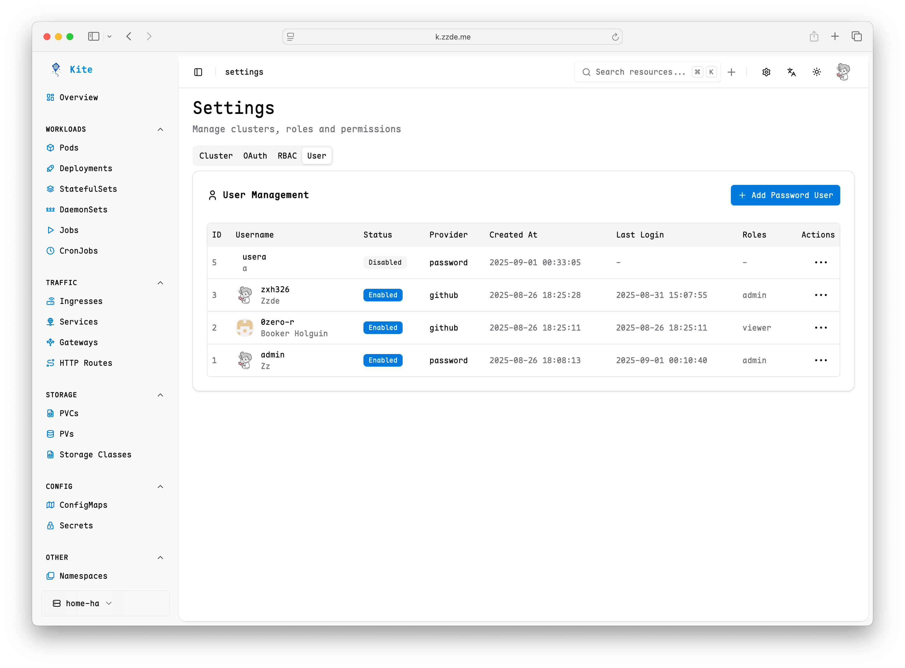

# User Management

Kite supports multiple user management methods, combining OAuth with local password users, and working with the RBAC permission system to achieve flexible access control.

## User Types

- **OAuth Users**: Login through third-party identity providers (such as GitHub, OIDC, etc.).

For how to configure OAuth, see [OAuth Configuration Guide](./oauth-setup)

- **Password Users**: Login through username and password.

## User Management

Users with the **admin** role can access the settings entry in the upper right corner of the page to enter the user and permission management interface.

In this interface, you can:

- View all current users and their role information
- Add new users (only password users are supported)
- Disable or delete accounts that are no longer needed
- Modify user role assignments to achieve permission adjustments

## Best Practices

- Recommend prioritizing OAuth users to achieve unified identity management
- Password users are suitable for special or temporary scenarios
- Regularly review user lists and role assignments to ensure minimal permissions
- Disable unused accounts to reduce security risks

For permission assignment, refer to [RBAC Permission Management](./rbac-config)
