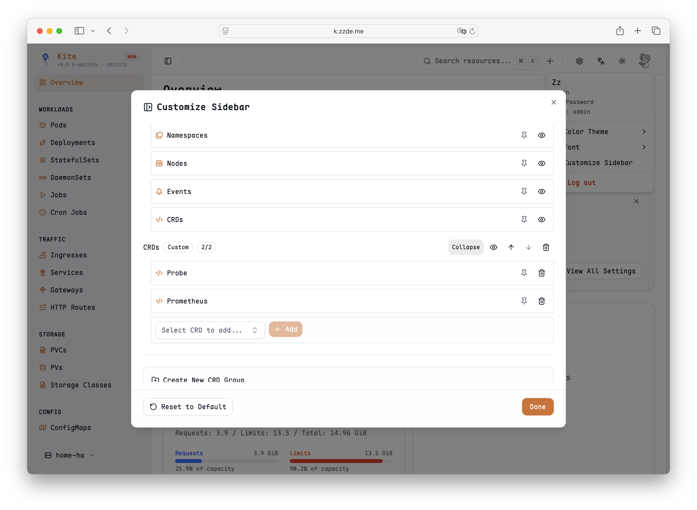

# Custom Sidebar

Kite supports customizing the sidebar. You can control the visibility and order of existing menu items, and also add CRDs (Custom Resource Definitions) to the sidebar for quick access.

## How to Customize

1.  Click the avatar button in the upper right corner.
2.  Find the `Custom Sidebar` option in the dropdown menu.

