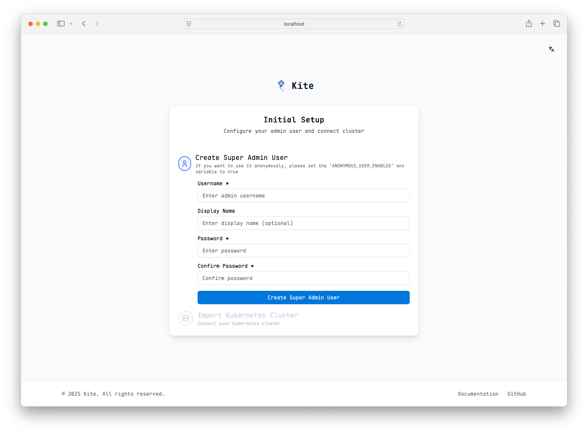
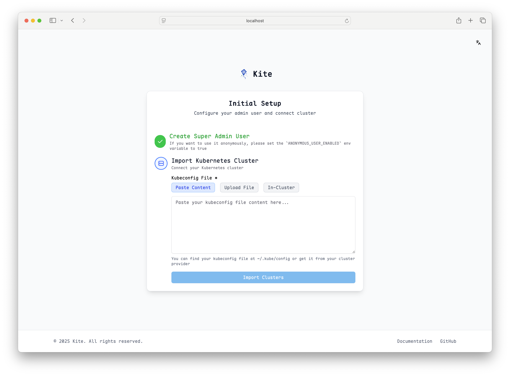

# Installation Guide

This guide provides detailed instructions for installing Kite in a Kubernetes environment.

## Prerequisites

- `kubectl` with cluster administrator privileges
- Helm v3 (recommended for Helm installation)
- MySQL/PostgreSQL database, or local storage for sqlite

## Installation Methods

### Method 1: Helm Chart (Recommended)

Using Helm provides flexibility for configuration and upgrades:

```bash
# Add Kite repository
helm repo add kite https://zxh326.github.io/kite

# Update repository information
helm repo update

# Install with default configuration
helm install kite kite/kite -n kite-system --create-namespace
```

#### Custom Installation

You can adjust installation parameters by customizing the values file:

For complete configuration, refer to [Chart Values](../config/chart-values).

Install with custom values:

```bash
helm install kite kite/kite -n kite-system -f values.yaml
```

### Method 2: YAML Manifest

For quick deployment, you can directly apply the official installation YAML:

```bash
kubectl apply -f https://raw.githubusercontent.com/zxh326/kite/main/deploy/install.yaml
```

This method will install Kite with default configuration. For advanced customization, it's recommended to use the Helm Chart.

## Accessing Kite

### Port Forwarding (Testing Environment)

During testing, you can quickly access Kite through port forwarding:

```bash
kubectl port-forward -n kite-system svc/kite 8080:8080
```

### LoadBalancer Service

If the cluster supports LoadBalancer, you can directly expose the Kite service:

```bash
kubectl patch svc kite -n kite-system -p '{"spec": {"type": "LoadBalancer"}}'
```

Get the assigned IP:

```bash
kubectl get svc kite -n kite-system
```

### Ingress (Recommended for Production)

For production environments, it's recommended to expose Kite through an Ingress controller with TLS enabled:

::: warning
Kite's log and web terminal features require websocket support.
Some Ingress controllers may require additional configuration to handle websockets correctly.
:::

```yaml
apiVersion: networking.k8s.io/v1
kind: Ingress
metadata:
  name: kite
  namespace: kite-system
spec:
  ingressClassName: nginx
  rules:
    - host: kite.example.com
      http:
        paths:
          - path: /
            pathType: Prefix
            backend:
              service:
                name: kite
                port:
                  number: 8080
  tls:
    - hosts:
        - kite.example.com
      secretName: kite-tls
```

## Serving under a subpath (basePath)

If you want to serve Kite under a subpath (for example `https://example.com/kite`), use the Helm chart `basePath` value.

How to set it:

- In `values.yaml`:

```yaml
basePath: "/kite"
```

- Or with Helm CLI:

```fish
helm install kite kite/kite -n kite-system --create-namespace --set basePath="/kite"
```

Important notes:

- Ingress configuration: make sure your Ingress `paths` match the subpath and use a matching pathType (e.g., `Prefix`). Example:

```yaml
ingress:
  enabled: true
  hosts:
    - host: kite.example.com
      paths:
        - path: /kite
          pathType: Prefix
```

- OAuth / redirects: if you enable OAuth (or any external redirect flows), update the redirect URLs in your OAuth provider to include the base path, e.g. `https://kite.example.com/kite/oauth/callback`.
- Environment overrides: if you provide environment variables via `extraEnvs` or an existing secret, ensure `KITE_BASE` is set consistently with the `basePath` value (otherwise behavior may differ).

## Verifying Installation

After installation, you can access the dashboard to verify that Kite is deployed successfully. The expected interface is as follows:

::: tip
If you need to configure Kite through environment variables, please refer to [Environment Variables](../config/env).
:::





You can complete cluster setup according to the page prompts.

## Uninstalling Kite

### Helm Uninstall

```bash
helm uninstall kite -n kite-system
```

### YAML Uninstall

```bash
kubectl delete -f https://raw.githubusercontent.com/zxh326/kite/main/deploy/install.yaml
```

## Next Steps

After Kite installation is complete, you can continue with:

- [Adding Users](../config/user-management)
- [Configuring RBAC](../config/rbac-config)
- [Configuring OAuth Authentication](../config/oauth-setup)
- [Setting up Prometheus Monitoring](../config/prometheus-setup)
