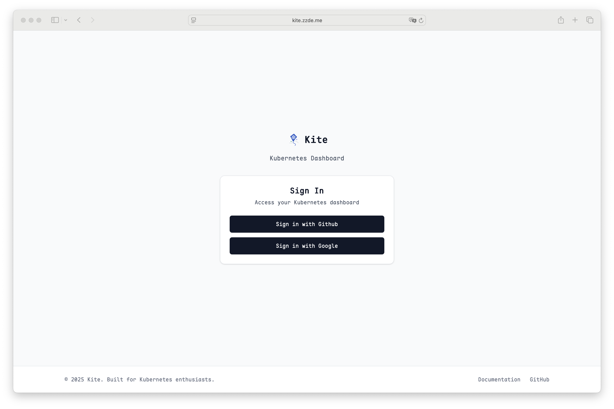

# OAuth 设置指南

本指南介绍如何为 Kite 配置 OAuth 认证，支持多种认证提供商。

## 在供应商处创建 OAuth 应用

1. 登录到您的 OAuth 供应商账户（如 GitHub、Google 等）。
2. 创建一个新的 OAuth 应用，填写必要的信息。
3. 在重定向 URI 中填写 `https://${HOST}/api/auth/callback`，将 `${HOST}` 替换为您的 Kite 部署地址。
   1. 例如，如果您的 Kite 部署在 `kite.example.com`，则重定向 URI 应为 `https://kite.example.com/api/auth/callback`。
   2. kite 默认使用请求的后端 Host 和协议来生成重定向 Host。
   3. 如果 kite 部署在代理后面，默认会读取 `X-Forwarded-Host` 和 `X-Forwarded-Proto` 头部。
   4. 如果上述信息不可用，你可以配置 `HOST` 环境变量显示指定。
4. 记录下生成的 Client ID 和 Client Secret。

## 配置

在具有 **admin** 角色用户界面中，页面右上角上角将显示设置入口。

遵循页面中的指示填写基本信息即使用 OAuth 登录。

## 常见问题

### 用户登录后显示没有权限使用

默认情况下，即使登录成功，Kite 也不会授予用户任何权限。您需要手动配置 RBAC 规则来授予访问权限。

查看 [RBAC 配置指南](./rbac-config) 获取详情。

### 如何将 OAuth 用户映射到 RBAC 角色？

您可以在设置中配置 OAuth 用户与 RBAC 角色之间的映射关系。具体步骤请参考 [RBAC 配置指南](./rbac-config)。

### 登录失败

一般来说这类都属于配置问题，您可以检查以下几点：

1. 确保 OAuth 应用的 Client ID 和 Client Secret 配置正确。
2. 检查重定向 URI 是否与 OAuth 应用中配置的匹配。
3. 查看 Kite 日志以获取更多错误信息。
