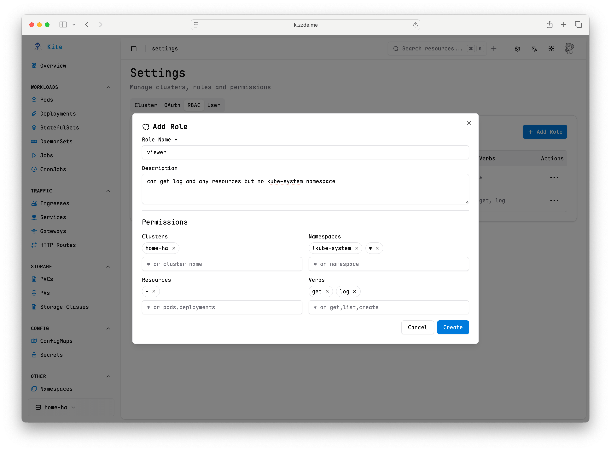

# RBAC 配置指南

本指南介绍如何在 Kite 中配置基于角色的访问控制（RBAC），以高效管理用户权限和资源访问。

## 概述

Kite 的 RBAC 系统支持：

- 定义具备特定权限的自定义角色
- 将角色分配给用户或 OAuth 组
- 在集群、命名空间和资源级别灵活控制访问
- 为每个角色指定允许的操作（动词）

## 配置

拥有 **admin** 角色的用户可在页面右上角进入设置入口。

系统默认提供两类不可编辑和删除的角色：

- **admin**：拥有管理所有资源的全部权限
- **viewer**：拥有查看所有资源和日志的权限



每个角色可指定以下字段：

| 字段          | 描述             | 示例                                                          |
| ------------- | ---------------- | ------------------------------------------------------------- |
| `name`        | 角色标识符       | `admin`、`viewer`                                             |
| `description` | 简要描述（可选） | `具有完全访问权限的管理员角色`                                |
| `clusters`    | 适用集群         | `!prod`、`dev` 表示可访问 dev 但不可访问 prod                 |
| `resources`   | 可访问资源       | `pods`、`deployments` 表示特定资源                            |
| `namespaces`  | 适用命名空间     | `!kube-system`、`*` 表示可访问除 `kube-system` 外所有命名空间 |
| `verbs`       | 允许操作         | `get` 表示只读操作                                            |

### 支持的操作动词

- 通用资源：`get`、`create`、`update`、`delete`
- Pod 专用：`exec`、`log`（用于 Pod 终端和日志访问）
- 节点专用：`exec`（用于节点终端访问）
- 通配符：`*`（所有操作）

### 映射角色到 OAuth 组

可为特定 OAuth 组分配角色，使组内所有用户自动继承相应权限。

注意：部分 OAuth 组可能无法返回用户的组和权限信息，建议使用 [DEX](https://github.com/dexidp/dex) 项目作为中转。请确保 OAuth 的 scope 包含 `groups` 或 `roles`。

在 Role Actions 中可配置或取消组映射。


### 映射角色到用户

可为指定用户分配角色，使其获得相应权限。


## 示例场景

### 场景 1：测试环境

可访问所有 test、beta 命名空间的资源，但禁止更新和删除。

配置示例：

```
clusters: *
resources: *
namespaces: test, beta
verbs: !delete, !update, *
```

### 场景 2：集群管理员

为 `test-cluster` 集群管理员分配全部操作权限。

配置示例：

```
clusters: test-cluster
resources: *
namespaces: *
verbs: *
```

### 场景 3：为所有 OAuth 用户设置默认角色

当你的 OAuth 供应商是可以信任的，例如公司内部 OA 系统。
你可以选中某个角色，将 username 设置为 `*` 赋予该角色。参考示例


## 最佳实践

1. **最小权限原则**：仅为角色分配必要权限
2. **优先使用命名空间角色**：尽量将访问限制在特定命名空间
3. **避免通配符用户**：生产环境中应明确指定用户，避免使用 `"*"`
4. **定期审计**：定期检查和优化角色映射
5. **测试访问**：更改后及时验证权限效果
