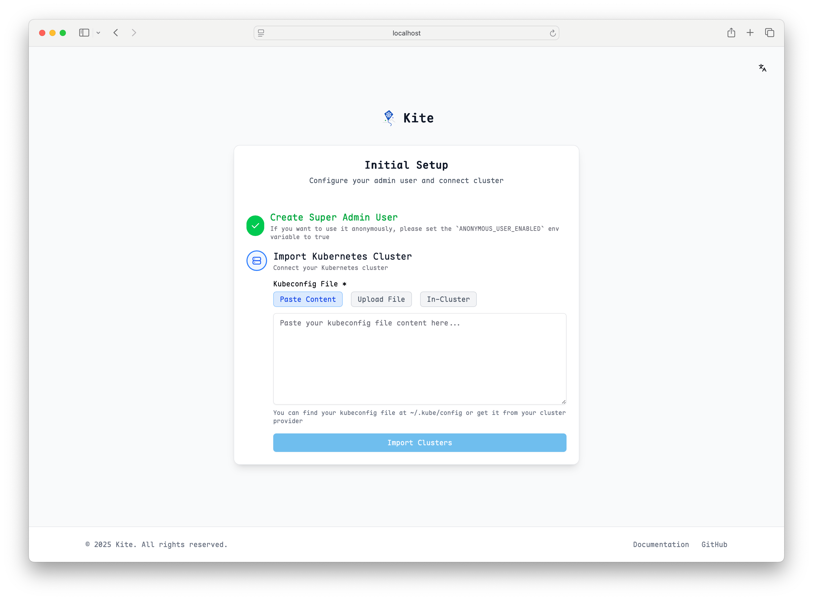

# 安装指南

本指南详细介绍如何在 Kubernetes 环境下安装 Kite。

## 前提条件

- 拥有集群管理员权限的 `kubectl`
- Helm v3（推荐使用 Helm 安装）
- MySQL/PostgreSQL 数据库，或本地存储用于 sqlite

## 安装方式

### 方式一：Helm Chart（推荐）

使用 Helm 可灵活配置和升级 Kite：

```bash

# 添加 Kite 仓库
helm repo add kite https://zxh326.github.io/kite

# 更新仓库信息
helm repo update

# 使用默认配置安装
helm install kite kite/kite -n kite-system --create-namespace
```

#### 自定义安装

可通过自定义 values 文件调整安装参数：

完整配置参考 [Chart Values](../config/chart-values)。

使用自定义值安装：

```bash
helm install kite kite/kite -n kite-system -f values.yaml
```

### 方式二：YAML 清单

如需快速部署，可直接应用官方安装 YAML：

```bash
kubectl apply -f https://raw.githubusercontent.com/zxh326/kite/main/deploy/install.yaml
```

此方法将使用默认配置安装 Kite。如需高级定制，建议使用 Helm Chart。

## 访问 Kite

### 端口转发（测试环境）

测试期间可通过端口转发快速访问 Kite：

```bash
kubectl port-forward -n kite-system svc/kite 8080:8080
```

### LoadBalancer 服务

如集群支持 LoadBalancer，可直接暴露 Kite 服务：

```bash
kubectl patch svc kite -n kite-system -p '{"spec": {"type": "LoadBalancer"}}'
```

获取分配的 IP：

```bash
kubectl get svc kite -n kite-system
```

### Ingress（生产环境推荐）

生产环境建议通过 Ingress 控制器并启用 TLS 暴露 Kite：

::: warning
Kite 的日志和 Web 终端功能需支持 websocket。
部分 Ingress 控制器可能需额外配置以正确处理 websocket。
:::

```yaml
apiVersion: networking.k8s.io/v1
kind: Ingress
metadata:
  name: kite
  namespace: kite-system
spec:
  ingressClassName: nginx
  rules:
    - host: kite.example.com
      http:
        paths:
          - path: /
            pathType: Prefix
            backend:
              service:
                name: kite
                port:
                  number: 8080
  tls:
    - hosts:
        - kite.example.com
      secretName: kite-tls
```

## 验证安装

安装完成后，可访问仪表盘验证 Kite 是否部署成功。预期界面如下：

::: tip
如需通过环境变量配置 Kite，请参考 [环境变量](../config/env)。
:::




可根据页面提示完成集群设置。

## 卸载 Kite

### Helm 卸载

```bash
helm uninstall kite -n kite-system
```

### YAML 卸载

```bash
kubectl delete -f https://raw.githubusercontent.com/zxh326/kite/main/deploy/install.yaml
```

## 后续步骤

Kite 安装完成后，您可以继续：

- [添加用户](../config/user-management)
- [配置 RBAC](../config/rbac-config)
- [配置 OAuth 认证](../config/oauth-setup)
- [设置 Prometheus 监控](../config/prometheus-setup)
