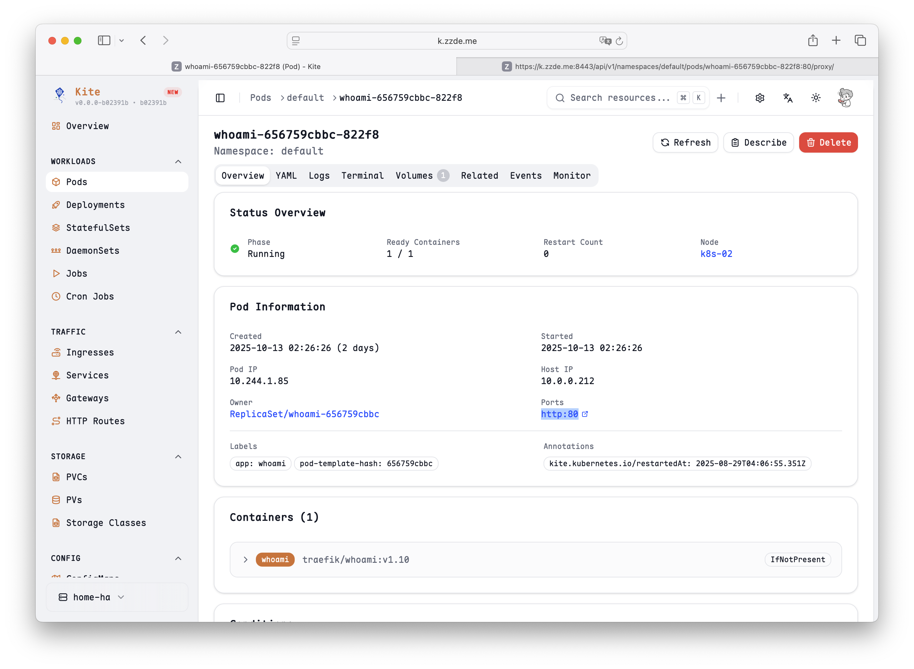
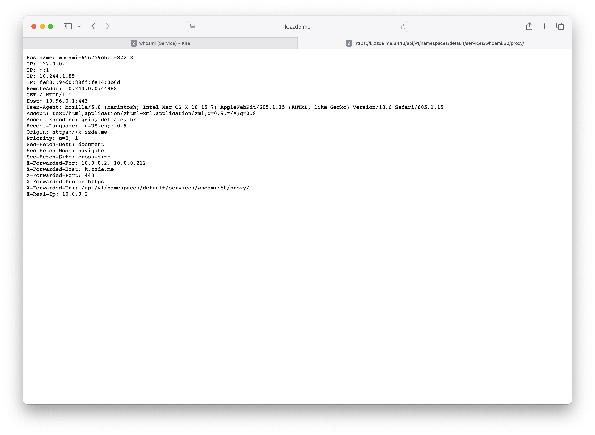

# Kube Proxy

Kite 内置了 kubectl Proxy 功能，让您可以直接通过 Kite 访问 Pods 或 Services，无需在本地运行 `kubectl port-forward`。

## 如何使用

1.  导航到您想要访问的 Pod 或 Service 详情页。
2.  在 `端口` 部分，直接点击即可访问。

## 注意事项

1. 如果需要访问的 Pod 或 Service 是前端服务，则可能无法正常访问。
2. 只支持代理 HTTP 服务。
