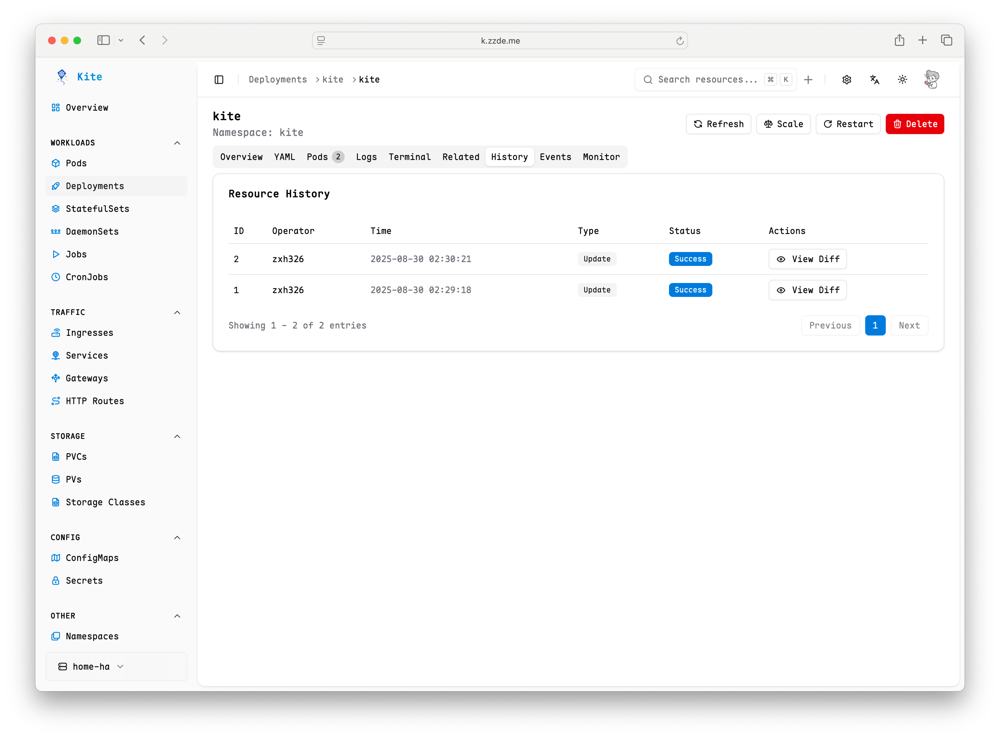
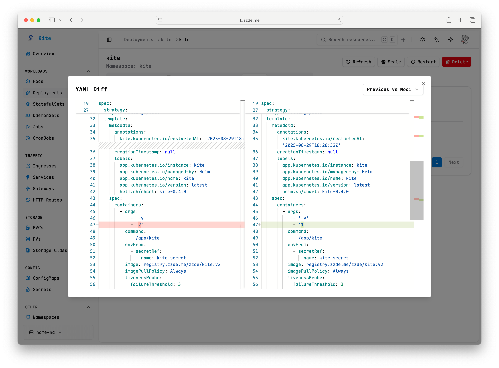

# 资源历史

Kite 会为集群中的 Kubernetes 资源记录操作历史（创建、更新、删除，以及通过 YAML Apply 的变更）。你可以在详情页中查看每次变更的时间、操作者、是否成功，以及变更前后 YAML 的差异，并据此进行回滚。

::: tip
需要具备相应资源的“读”权限，才能查看其历史；具备“写”权限才能进行编辑或回滚。
:::

## 功能概览

- 记录维度：集群、资源类型、命名空间、资源名、操作类型（create/update/delete/apply）、操作者、是否成功、错误信息。
- 变更对比：内置 YAML Diff 查看器，默认对比“上一次版本”和“本次版本”，也可切换与“当前集群中的版本”对比。Diff 中会自动忽略 `status` 和 `managedFields` 字段，便于聚焦配置差异。

